<div align="center">

# ⚖️ CaseIntelix

**AI-Powered Legal Case Intelligence Platform**

Upload case documents, get grounded AI answers with page-level citations, auto-extracted case intelligence, and drafted legal letters — all running on a fully free, multi-provider AI stack.

[**🌐 Live Demo**](https://caselens-web.vercel.app) · [Free Hosting Guide](docs/DEPLOYMENT_FREE_HOSTING.md) · [System Architecture](docs/SYSTEM_ARCHITECTURE.md)

     

</div>

<br/>

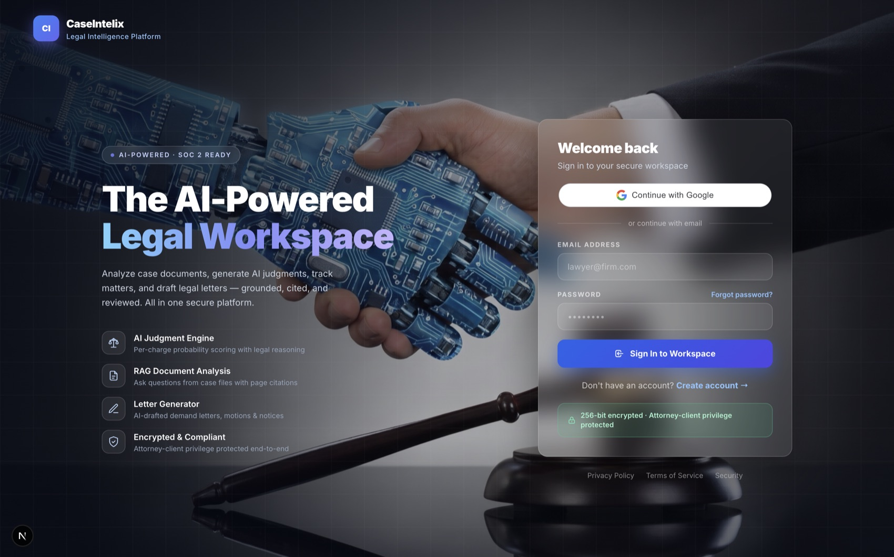

<br/>

## What is CaseIntelix?

CaseIntelix is a **multi-tenant legal case-intelligence workspace**. A law firm uploads case documents (PDFs), and the platform:

- **Extracts structured case intelligence** — defendant/parties, key dates, a veracity score, allegations, contradictions between witness statements, and predicted outcomes.
- **Answers questions with citations** — a RAG (retrieval-augmented generation) pipeline retrieves the exact passages that support an answer and cites `[Source N]` back to the page they came from, so nothing is unverifiable.
- **Drafts legal letters** — demand letters, cease-and-desist notices, client updates, and more, grounded in the actual facts of the matter rather than generic boilerplate.
- **Never fabricates when unsure** — if the evidence is insufficient, the system explicitly abstains instead of guessing, and every AI response is flagged `requires_human_review` with a legal disclaimer.

It's built the way a real legal-tech product would be: multi-tenant, audited, and safety-conscious about what "AI-generated legal content" means — not a toy demo.

## Why this project is interesting (from an engineering standpoint)

This isn't just "call an LLM API." A few things worth a closer look:

1. **A self-healing, multi-provider AI gateway.** Every AI call goes through a provider abstraction (`ai_gateway/`) with an ordered fallback chain across five *independent* free-tier providers (Cerebras → Groq → Gemini → Nvidia → OpenRouter). If one is rate-limited or down, the request fails over to the next automatically — with per-provider circuit breakers, structured logging of every attempt, and an honest error (never fake data) if all providers are genuinely unavailable. Chat and document-analysis each get their own tuned chain.
2. **Zero infrastructure cost, by design.** The document pipeline (PDF → text extraction → chunking → embeddings → AI analysis) runs as an async background task *inside* the API process — no message queue, no separate worker fleet required to run it. The codebase optionally supports dispatching the same pipeline to a Temporal workflow for heavier scale, behind one config flag, without touching call sites.
3. **Grounded retrieval, not "put a PDF in a vector DB and hope."** Retrieval combines Postgres full-text search *and* pgvector cosine similarity, merges and reranks the results, and only then builds the LLM prompt — with the retrieval counts, model, and provider all captured in an audit trail (`ModelRun`, `RetrievalRun`) for every single AI interaction.
4. **Real multi-tenant security**, not an afterthought: every document/chunk/embedding query is scoped by organization at the query level, JWT auth with short-lived access tokens + refresh tokens, bcrypt password hashing, PDF magic-byte validation, and an append-only audit log.

## Live demo

**https://caselens-web.vercel.app** — publicly deployed on **$0/month** infrastructure (see [`docs/DEPLOYMENT_FREE_HOSTING.md`](docs/DEPLOYMENT_FREE_HOSTING.md) for exactly how). Register an account or sign in with Google, upload a PDF, and watch it get analyzed in real time.

## Product tour

> Real screenshots from the running app.

### Command center

The dashboard surfaces active matters, document counts, average AI veracity score, and quick actions at a glance.

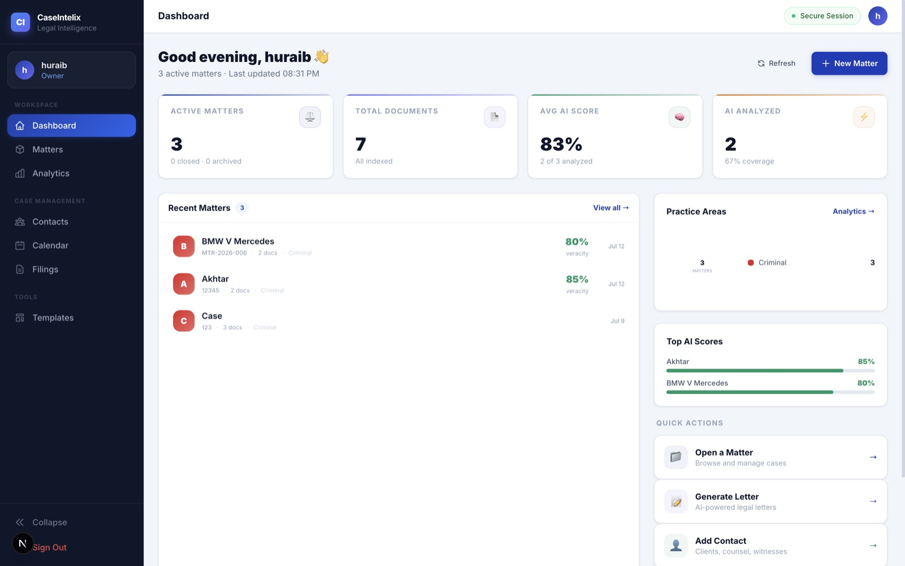

### Inside a case — the AI workspace

Each matter has a document library where you upload discovery files that get processed automatically (extract → chunk → embed → analyze), then opens into a six-tab intelligence workspace.

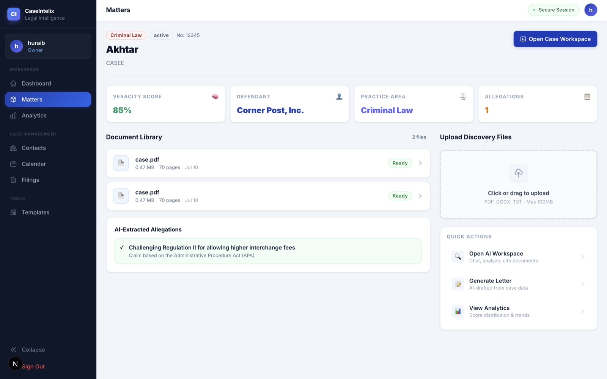

<table>
<tr>
<td width="50%">

**Overview** — case veracity score, AI verdict, and a multi-axis assessment radar (veracity, evidence, consistency, settlement, risk).

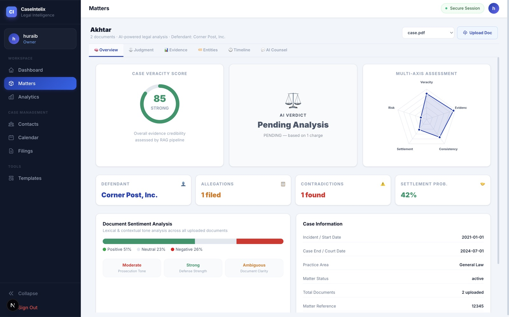

</td>
<td width="50%">

**Judgment** — per-charge conviction/settlement probability with legal reasoning and risk factors.

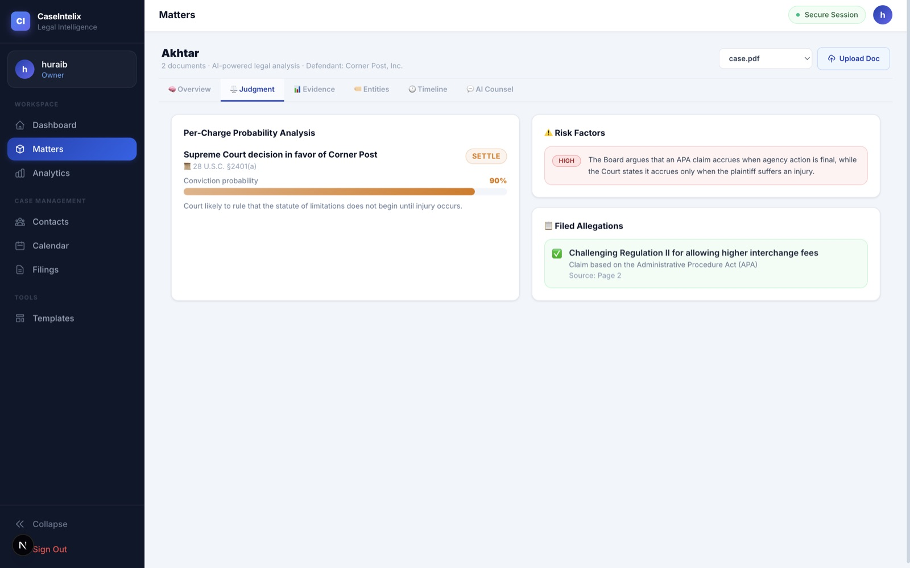

</td>
</tr>
<tr>
<td width="50%">

**Evidence** — BM25 + vector similarity + claim-consistency scoring, plus automatic contradiction detection across the document corpus.

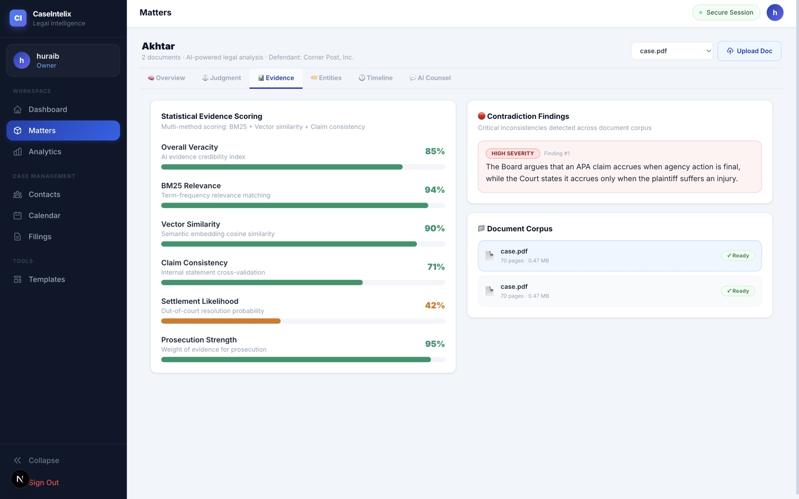

</td>
<td width="50%">

**Entities** — Legal-BERT named-entity recognition extracts parties, organizations, statutes, dates, and locations from the documents.

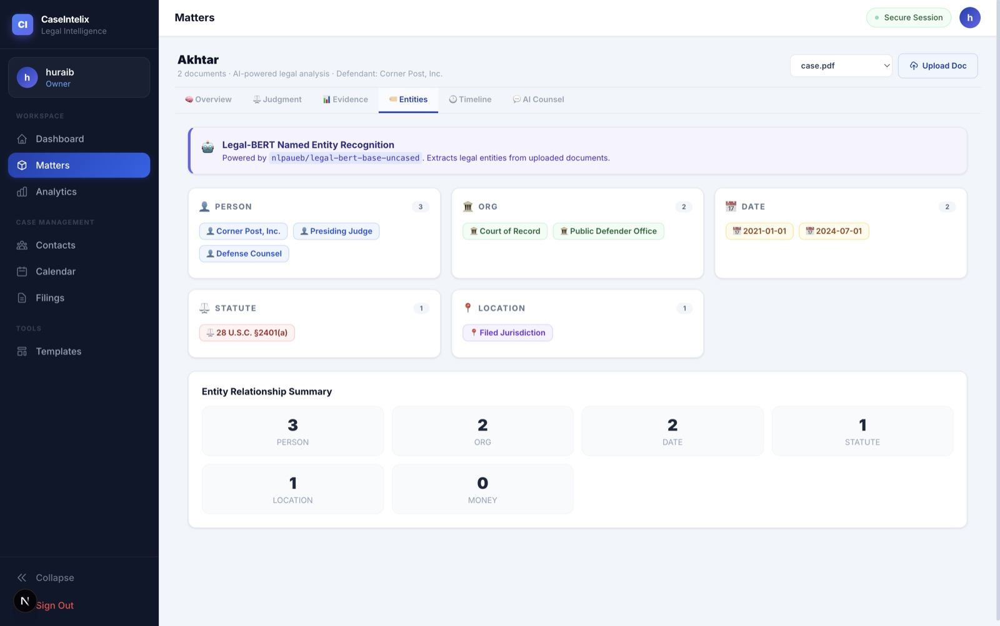

</td>
</tr>
<tr>
<td width="50%">

**Timeline** — a reconstructed case chronology with key dates and a duration analysis.

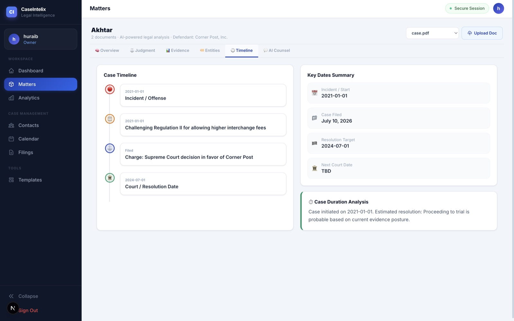

</td>
<td width="50%">

**AI Counsel** — grounded, cited Q&A over the case documents, with suggested starter prompts.

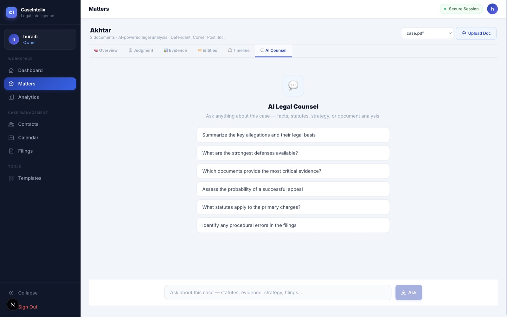

</td>
</tr>
</table>

### Managing the practice

<table>
<tr>
<td width="50%">

**Matters** — every case with its AI veracity score, practice area, and status.

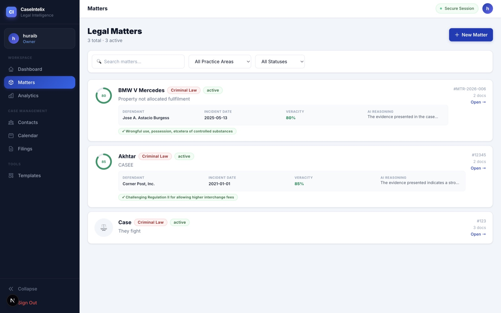

</td>
<td width="50%">

**Analytics** — veracity-score distribution, AI verdict predictions, and practice-area breakdown across all matters.

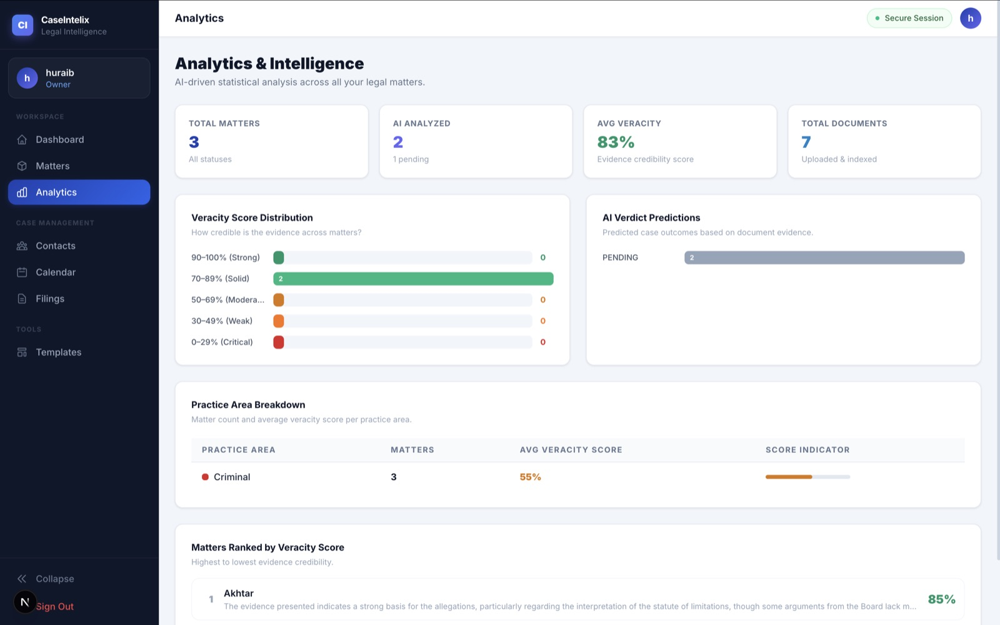

</td>
</tr>
<tr>
<td width="50%">

**Contacts** — clients, opposing counsel, experts, witnesses, and judges across every matter.

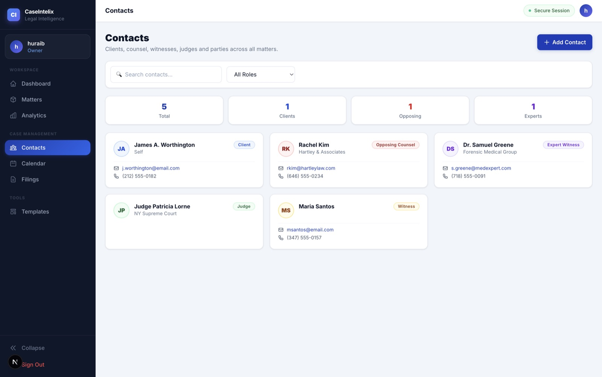

</td>
<td width="50%">

**Calendar** — hearings, filing deadlines, depositions, and court dates in one timeline.

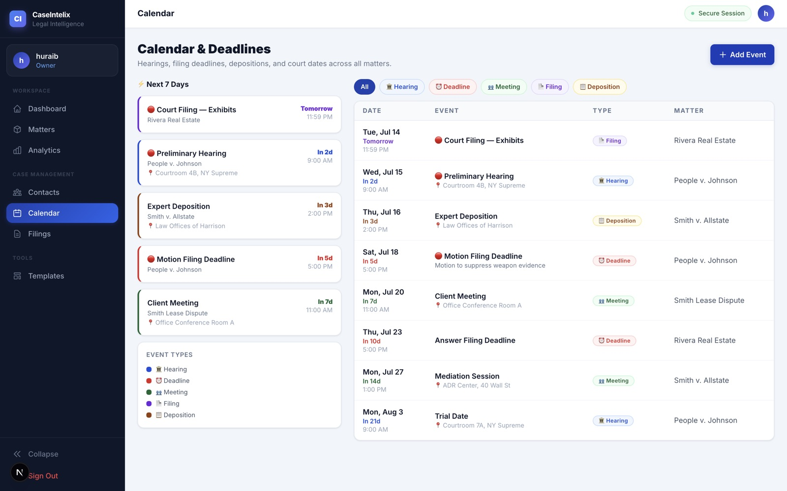

</td>
</tr>
</table>

### AI Letter Generator

Pick a template, select a matter, and the system auto-fills the defendant, veracity score, and key dates it already extracted from your documents before drafting a complete, ready-to-review letter grounded in the case evidence.

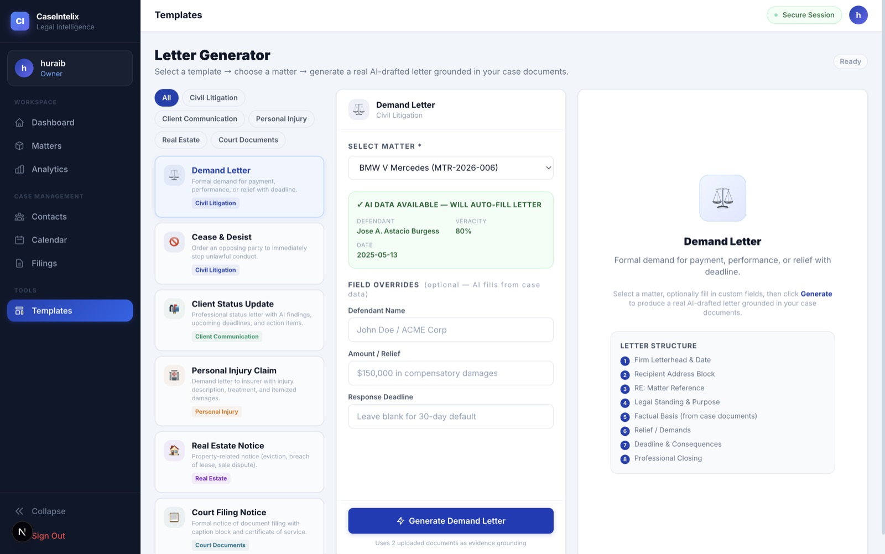

## Core features

| Feature | Description |
|---|---|
| 📄 **AI Case Intelligence** | Auto-extracts suspect/defendant, key dates, a veracity score, allegations, contradictions, and predicted outcomes from uploaded documents |
| 💬 **Cited RAG Chat** | Ask natural-language questions about a matter; answers are grounded in retrieved passages with page-level citations and an explicit abstention path |
| 📝 **AI Letter Generator** | Drafts demand letters, cease-and-desist notices, client updates, court filing notices, and more — grounded in the matter's actual facts |
| 🔐 **Google Sign-In + Email Auth** | OAuth via Google Identity Services, or traditional email/password with bcrypt hashing |
| 🏢 **Multi-Tenant Organizations** | Organizations → Matters → Members, with role-based access and strict tenant isolation at the query level |
| 🧾 **Full Audit Trail** | Every AI call, retrieval, and review decision is recorded — provider used, tokens, latency, and human review status |
| ⚖️ **Legal-Safety Guardrails** | Every AI answer carries a disclaimer and `requires_human_review = true`; the system abstains rather than fabricates when evidence is thin |

## Architecture

```
┌─────────────┐        ┌──────────────────────────────────────────┐
│   Next.js   │  HTTPS │                 FastAPI                   │
│  (Vercel)   ├───────►│              (Render, free)                │
└─────────────┘        │                                            │
                        │  auth · organizations · matters · documents│
                        │  search · rag (ask / generate-letter)      │
                        │                                            │
                        │  ┌──────────────────────────────────────┐  │
                        │  │        AI Gateway (fallback chain)     │  │
                        │  │  Cerebras → Groq → Gemini → Nvidia →   │  │
                        │  │  OpenRouter   (all free-tier)          │  │
                        │  └──────────────────────────────────────┘  │
                        │                                            │
                        │  ┌──────────────────────────────────────┐  │
                        │  │  Inline document pipeline              │  │
                        │  │  extract → chunk → embed → analyze     │  │
                        │  │  (async background task, no queue)     │  │
                        │  └──────────────────────────────────────┘  │
                        └───────┬───────────────────────┬────────────┘
                                │                        │
                     ┌──────────▼─────────┐   ┌──────────▼─────────┐
                     │  Postgres+pgvector  │   │   S3-compatible     │
                     │     (Supabase)      │   │  object storage     │
                     │  full-text + vector │   │ (Supabase Storage)  │
                     │      search         │   │                     │
                     └─────────────────────┘   └─────────────────────┘
```

**Retrieval pipeline (`/matters/{id}/ask`):** Postgres full-text search + pgvector cosine similarity run in parallel → results merged and reranked → top-k passages built into a grounded prompt → LLM generates a cited answer → citations, retrieval metadata, and the answer are persisted for audit.

**Document pipeline (on upload):** PDF validated (magic bytes) → text extracted per page (PyMuPDF) → page-aware token chunking (tiktoken, 512 tokens / 64 overlap, never crosses a page boundary) → chunks embedded in batches → structured case-intelligence JSON extracted via the AI gateway → document marked `READY`. Every step is idempotent and safe to re-run.

## Tech stack

| Layer | Technology |
|---|---|
| **Frontend** | Next.js 16 (App Router) · React 19 · TypeScript · Tailwind CSS 4 |
| **Backend** | FastAPI · SQLAlchemy 2.0 (async) · Pydantic v2 · Alembic |
| **Database** | PostgreSQL + `pgvector` (hybrid full-text + vector search) |
| **Auth** | JWT (access + refresh tokens) · bcrypt · Google Identity Services |
| **AI providers** | Cerebras · Groq · Google Gemini · Nvidia NIM · OpenRouter — orchestrated via a custom fallback-chain gateway |
| **Storage** | S3-compatible object storage (MinIO locally, Supabase Storage/Cloudflare R2 in production) |
| **Document processing** | PyMuPDF (text extraction) · tiktoken (chunking) · optional Temporal workflow engine for scaled/async processing |
| **Tooling** | `uv` (Python) · `pnpm` + Turborepo (monorepo) · `ruff` + `mypy --strict` · `pytest` |
| **Hosting** | Vercel (web) · Render (API) · Supabase (DB + storage) — **$0/month** |

## Project structure

```
apps/
  web/      Next.js frontend (App Router, Tailwind)
  api/      FastAPI backend — auth, orgs, matters, documents, RAG, AI gateway
  worker/   Optional Temporal worker (only used if DOCUMENT_PROCESSING_MODE=temporal)
packages/
  contracts/  Shared TypeScript DTOs
  types/      Shared TypeScript enums/types
infrastructure/
  docker/     Dockerfiles + docker-compose for local infra (Postgres, Redis, MinIO, Temporal)
docs/
  SYSTEM_ARCHITECTURE.md · RAG_AND_CITATION_DESIGN.md · SECURITY_THREAT_MODEL.md
  DEPLOYMENT_FREE_HOSTING.md · decisions/ (ADRs) · and more
```

## Getting started locally

**Prerequisites:** Node ≥20, Python 3.12+, [`uv`](https://docs.astral.sh/uv/), [`pnpm`](https://pnpm.io/), Docker.

```bash
git clone https://github.com/huraibjan/caseintelix.git
cd caseintelix
make setup      # installs JS + Python deps, copies .env, starts Postgres/Redis/MinIO/Temporal
make dev        # starts the API, worker, and web dev server together
```

Then open **http://localhost:3000**. See [`.env.example`](.env.example) for every configuration option (all AI provider keys are optional — the app runs and degrades gracefully with whichever keys you supply).

Useful commands (see [`Makefile`](Makefile) for the full list):

```bash
make test        # run backend + frontend tests
make lint        # ruff (Python) + eslint (web)
make typecheck   # mypy --strict (Python) + tsc (web)
```

## Deployment

CaseIntelix is designed to be deployable entirely on free tiers — no credit card required for the core path. The document-processing pipeline runs inside the API process by default, so there's no message broker or worker fleet to host. Full step-by-step instructions (Supabase, Render, Vercel, Google OAuth) are in [`docs/DEPLOYMENT_FREE_HOSTING.md`](docs/DEPLOYMENT_FREE_HOSTING.md).

## Security & compliance posture

- Multi-tenant data isolation enforced at the query level (organization-scoped everywhere)
- JWT auth with short-lived access tokens + refresh tokens; bcrypt password hashing
- PDF upload validated by file signature, not just extension; size-limited
- Append-only audit log for security-relevant actions
- Every AI response includes a legal disclaimer and is flagged for mandatory human review
- No AI provider is used for training on your data; only the minimum context needed is sent per request

See [`docs/SECURITY_THREAT_MODEL.md`](docs/SECURITY_THREAT_MODEL.md) and the in-app [Security](https://caselens-web.vercel.app/security) page for details.

## License

This project is currently unlicensed (all rights reserved). Contact the author for reuse permissions.

---

<div align="center">
Built by <a href="https://github.com/huraibjan">huraibjan</a>
</div>
