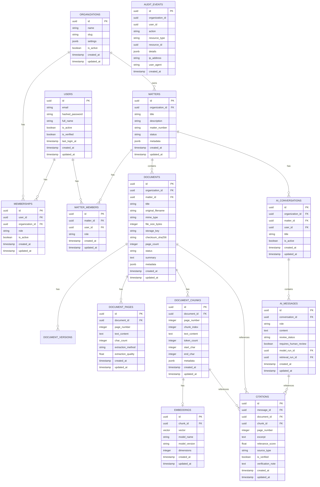

# CaseLens Database ERD

This document maps the core database relationships using Mermaid notation.

```mermaid
erDiagram
    ORGANIZATIONS ||--o{ MEMBERSHIPS : has
    ORGANIZATIONS ||--o{ MATTERS : owns
    USERS ||--o{ MEMBERSHIPS : has
    USERS ||--o{ MATTER_MEMBERS : has
    MATTERS ||--o{ MATTER_MEMBERS : has
    MATTERS ||--o{ DOCUMENTS : contains
    MATTERS ||--o{ AI_CONVERSATIONS : has
    DOCUMENTS ||--o{ DOCUMENT_VERSIONS : has
    DOCUMENTS ||--o{ DOCUMENT_PAGES : has
    DOCUMENTS ||--o{ DOCUMENT_CHUNKS : has
    DOCUMENT_CHUNKS ||--o| EMBEDDINGS : has
    AI_CONVERSATIONS ||--o{ AI_MESSAGES : contains
    AI_MESSAGES ||--o{ CITATIONS : references
    DOCUMENTS ||--o{ CITATIONS : references
    DOCUMENT_CHUNKS ||--o{ CITATIONS : references

    ORGANIZATIONS {
        uuid id PK
        string name
        string slug
        jsonb settings
        boolean is_active
        timestamp created_at
        timestamp updated_at
    }

    USERS {
        uuid id PK
        string email
        string hashed_password
        string full_name
        boolean is_active
        boolean is_verified
        timestamp last_login_at
        timestamp created_at
        timestamp updated_at
    }

    MEMBERSHIPS {
        uuid id PK
        uuid user_id FK
        uuid organization_id FK
        string role
        boolean is_active
        timestamp created_at
        timestamp updated_at
    }

    MATTERS {
        uuid id PK
        uuid organization_id FK
        string title
        string description
        string matter_number
        string status
        jsonb metadata
        timestamp created_at
        timestamp updated_at
    }

    MATTER_MEMBERS {
        uuid id PK
        uuid matter_id FK
        uuid user_id FK
        string role
        timestamp created_at
        timestamp updated_at
    }

    DOCUMENTS {
        uuid id PK
        uuid organization_id FK
        uuid matter_id FK
        string title
        string original_filename
        string mime_type
        integer file_size_bytes
        string storage_key
        string checksum_sha256
        integer page_count
        string status
        text summary
        jsonb metadata
        timestamp created_at
        timestamp updated_at
    }

    DOCUMENT_PAGES {
        uuid id PK
        uuid document_id FK
        integer page_number
        text text_content
        integer char_count
        string extraction_method
        float extraction_quality
        timestamp created_at
        timestamp updated_at
    }

    DOCUMENT_CHUNKS {
        uuid id PK
        uuid document_id FK
        integer page_number
        integer chunk_index
        text text_content
        integer token_count
        integer start_char
        integer end_char
        jsonb metadata
        timestamp created_at
        timestamp updated_at
    }

    EMBEDDINGS {
        uuid id PK
        uuid chunk_id FK
        vector vector
        string model_name
        string model_version
        integer dimensions
        timestamp created_at
        timestamp updated_at
    }

    AI_CONVERSATIONS {
        uuid id PK
        uuid organization_id FK
        uuid matter_id FK
        uuid user_id FK
        string title
        boolean is_active
        timestamp created_at
        timestamp updated_at
    }

    AI_MESSAGES {
        uuid id PK
        uuid conversation_id FK
        string role
        text content
        string review_status
        boolean requires_human_review
        uuid model_run_id FK
        uuid retrieval_run_id FK
        timestamp created_at
        timestamp updated_at
    }

    CITATIONS {
        uuid id PK
        uuid message_id FK
        uuid document_id FK
        uuid chunk_id FK
        integer page_number
        text excerpt
        float relevance_score
        string source_type
        boolean is_verified
        text verification_note
        timestamp created_at
        timestamp updated_at
    }

    AUDIT_EVENTS {
        uuid id PK
        uuid organization_id
        uuid user_id
        string action
        string resource_type
        uuid resource_id
        jsonb details
        string ip_address
        string user_agent
        timestamp created_at
    }
```
